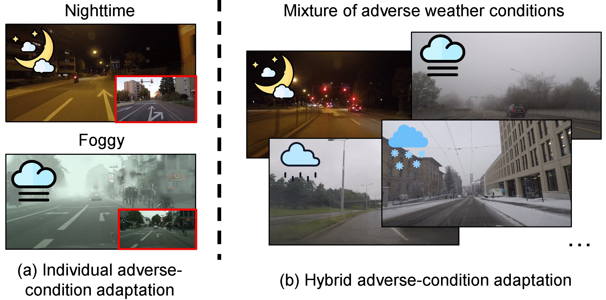

## Abstract

Generalizing models trained on normal visual conditions to target domains under adverse conditions is demanding in the
practical systems. One prevalent solution is to bridge the domain gap between clear- and adverse-condition images to
make satisfactory prediction on the target. However, previous methods often reckon on additional reference images of the
same scenes taken from normal conditions, which are quite tough to collect in reality. Furthermore, most of them mainly
focus on individual adverse condition such as nighttime or foggy, weakening the model versatility when encountering other
adverse weathers. To overcome the above limitations, we propose a novel framework, Visibility Boosting and
Logit-Constraint learning (VBLC), tailored for superior normal-to-adverse adaptation. VBLC explores the potential of
getting rid of reference images and resolving the mixture of adverse conditions simultaneously. In detail, we first
propose the visibility boost module to dynamically improve target images via certain priors in the image level. Then, we
figure out the overconfident drawback in the conventional cross-entropy loss for self-training method and devise the
logit-constraint learning, which enforces a constraint on logit outputs during training to mitigate this pain point.
To the best of our knowledge, this is a new perspective for tackling such a challenging task. Extensive experiments on
two normal-to-adverse domain adaptation benchmarks, i.e., Cityscapes $\rightarrow$ ACDC and Cityscapes $\rightarrow$
FoggyCityscapes + RainCityscapes, verify the effectiveness of VBLC, where it establishes the new state of the art.

---

## More Challenging Setting

Previous attempts on normal-to-adverse domain adaptation mostly require paired images for reference.
And different adverse conditions are handled separately.

In VBLC, we manage to achieve adaptation **without** the reliant on paired images, and take a step further to handle **multiple** adverse weather conditions with a **single** trained model.

{:width="100%"}

---

## Visual Results

VBLC yields high-quality segmentation results even under a mixure of adverse weather conditions. The effectiveness of our method can be attribute to both Visibility Boost Module (VBM) and Logit-Constraint Learning (LCL).

{:width="100%"}

---

## BibTeX

```bibtex
@article{li2022vblc,
  title={VBLC: Visibility Boosting and Logit-Constraint Learning for Domain Adaptive Semantic Segmentation under Adverse Conditions},
  author={Li, Mingjia and Xie, Binhui and Li, Shuang and Liu, Chi Harold and Cheng, Xinjing},
  journal={arXiv preprint arXiv:2211.12256},
  year={2022}
}
```
